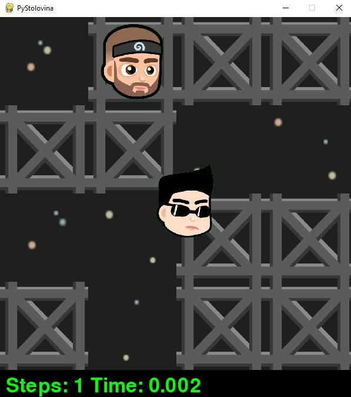
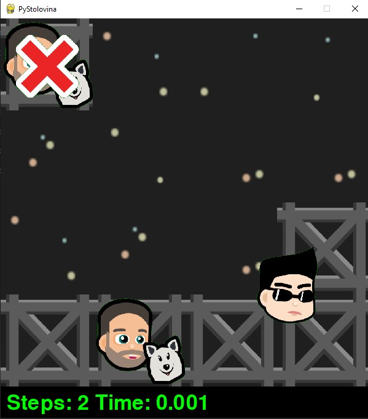

# PyStolovina
PyStolovina is a graphic simulation of sequential games written in Python programming language.

## Running the application
The program is run from terminal using command:
.\main.py map agent time_to_think max_levels

where
* .\main.py - path to main Python file with source code
* map - relative path to text file with map configuration (maps\map0.txt by default)
* agent - name of the agent class (StudentAgent by default)
* time_to_think - whole number which represents maximum time in seconds to make decision (1 second by default)
* max_levels - whole number which represents maximum depth of game tree

Before running, it is necessary to install pygame
package within the Python interpreter.

Pressing the SPACE key resumes and pauses the agent
moving through the map. Pressing the ESC key 
terminates the app and closes the main application window.

## Bots

*Aki* - Agent in every move choses an action which brings him closer to student agent by Manhattan distance,
and in the case of two or more such actions, he choses the field on the certain side of the world (north,
northeast, east, southeast, south, southwest, west, northwest). Agent is labeled with number 1.

*Jocke* - Agent in every move choses an action randomly. Agent is labeled with number 2.

*Draza* - Agent uses student implementation of Minimax algorithm with alpha-beta pruning. 
Agent is labeled with number 3.

*Bole* - Agent uses student implementation of Minimax algorithm for more than two players.
Agent is labeled with number 4.

## Agents

*MinimaxAgent* - Agent represents Minimax algorithm implementation for two rational players.

*MinimaxABAgent* - Agent represents Minimax algorithm implementation with alpha-beta pruning for two relational players.

*MaxNAgent* - Agent represents Minimax algorithm generalization for games with more than two rational 
players where every player plays for his own gain.

*ExpectAgent* - Agent represents Expectimax algorithm implementation for two players which consists of only Max and
Chance nodes. It is considered that every oponent plays randomly.

